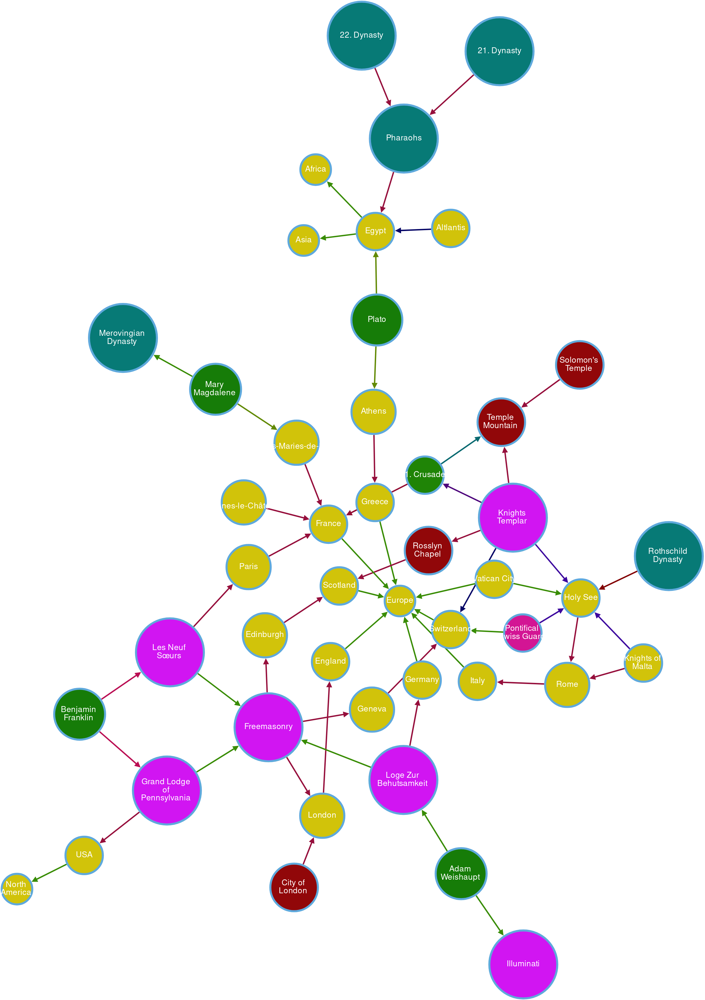

# Hidden History
A Graph-Database to visualize the hidden/forbidden history

## Prerequisites

* [agensgraph](https://github.com/bitnine-oss/agensgraph) - a transactional graph database based on PostgreSQL (http://www.agensgraph.com)

## Contributing

When contributing to this repository, please first discuss the change you wish to make via issue, email, or any other method with the owners of this repository before making a change.

## Authors

* **Joerg Roth** - *Initial work* - [Leylines](https://github.com/leylines)

See also the list of [contributors](https://github.com/leylines/hidden-history/contributors) who participated in this project.

## License

This project is licensed under the MIT License - see the [LICENSE](LICENSE) file for details

