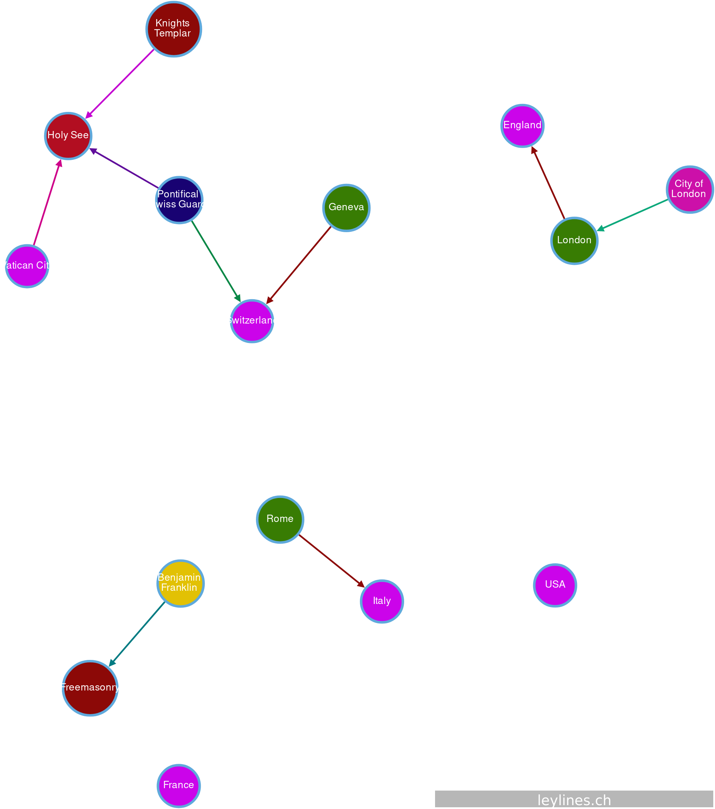

# agensgraph
Agensgraph-Scripts for different purposes

## Forbidden History

A Graph-Database to visualize the hidden/forbidden history

### Prerequisites

* [agensgraph](https://github.com/bitnine-oss/agensgraph) - a transactional graph database based on PostgreSQL (http://www.agensgraph.com)

### Contributing

When contributing to this repository, please first discuss the change you wish to make via issue, email, or any other method with the owners of this repository before making a change.

### Layout

#### Attributes

|attribute-name|type|
|---|---|
|name|string|
|other_name|string|
|fromdate|YYYY, YYYY-MM, YYYY-MM-DD, YYYY BC|
|todate|YYYY, YYYY-MM, YYYY-MM-DD, YYYY BC|
|status|proven\|unproven|

#### Node-Types

|name|description|attributes|
|---|---|---|
|sovereign_entity|sovereign entity but not a county|name, other_name, fromdate, todate|
|continent|continent|name|
|country|country as a sovereign entity|name, other_name, fromdate, todate|
|town|city, village etc.|name, other_name, fromdate, todate|
|place|churches, mountains etc.|name, other_name, fromdate, todate|
|force|force|name, other_name, fromdate, todate|
|order|order|name, other_name, fromdate, todate|
|dynasty|dynasty|name, other_name, fromdate, todate|
|family|family|name, other_name, fromdate, todate|
|person|person|name, other_name, fromdate, todate|

#### Edge-Types

|name|description|attributes|
|---|---|---|
|located|geographic allocation|name, fromdate, todate, status|
|serves|serves|name, fromdate, todate, status|
|belongs_to|belongs to|name, fromdate, todate, status|
|follows|follows|name, fromdate, todate, status|
|controls|controls|name, fromdate, todate, status|
|lives_in|lives in|name, fromdate, todate, status|
|member_of|member of|name, fromdate, todate, status|
|related|related (personal)|name, fromdate, todate, status|
|knows|knows|name, fromdate, todate, status|

### Authors

* **Joerg Roth** - *Initial work* - [Leylines](https://github.com/leylines)

See also the list of [contributors](https://github.com/leylines/agensgraph/contributors) who participated in this project.

### License

This project is licensed under the MIT License - see the [LICENSE](LICENSE) file for details

